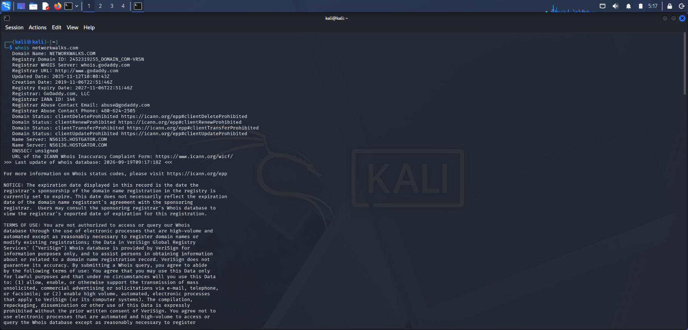
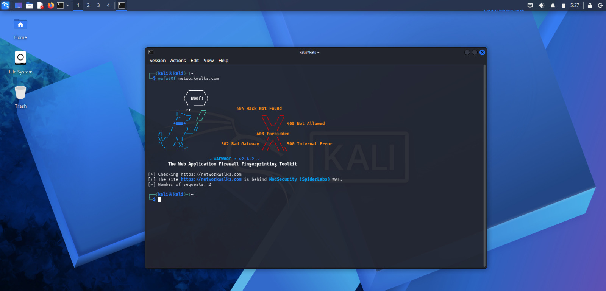

# NETWORKWALKS-B083-WK2-PM1-CYBERSECURITY-RECONNAISSANCE-AND-NETWORK-SCANNING

## Cybersecurity Internship – Week 2

This repository contains my Week 2 practical work completed as part of my Networkwalks Cybersecurity Internship.

The main focus of this week was learning the basics of **reconnaissance, information gathering, web analysis, DNS enumeration, WAF detection, and network scanning** using cybersecurity tools available in Kali Linux.

---

## Objectives

The objectives of this practical were:

- Understand basic reconnaissance techniques.
- Collect publicly available information about a target.
- Perform DNS and domain enumeration.
- Identify web application technologies and WAF protection.
- Analyze HTTP responses.
- Perform basic network scanning.
- Understand how reconnaissance information can be useful during security assessments.

---

## Tools Used

| Tool | Purpose |
|---|---|
| WHOIS | Domain and registration information |
| WhatWeb | Web technology identification |
| Nslookup | DNS information gathering |
| Curl | HTTP response analysis |
| Wafw00f | WAF detection |
| DNSRecon | DNS enumeration |
| Zenmap | Network scanning |

---

# Reconnaissance & Information Gathering

## 1. WHOIS

WHOIS was used to collect publicly available information related to the domain.

The information gathered can include domain registration details, registrar information, nameservers, and other publicly available records.

### 📸 Screenshot



---

## 🌐 2. WhatWeb

WhatWeb was used to identify technologies and components associated with the target website.

It can provide information about web technologies, frameworks, servers, CMS platforms, and other detectable components.

### 📸 Screenshot


---

 ## 3. Nslookup

Nslookup was used to perform DNS queries and check domain name resolution.

This helped me understand how domain names are resolved to their corresponding IP addresses and how DNS information can be gathered during reconnaissance.

### Screenshot


---

## 4. Curl

Curl was used to communicate with the web server and inspect HTTP responses.

This helped me understand how information such as HTTP headers and server responses can be examined during web reconnaissance.

### Screenshot


---

## 5. Wafw00f

Wafw00f was used to check whether a Web Application Firewall was present on the target.

Understanding WAF detection is useful during security assessments because it provides information about the defensive technologies protecting a web application.

### Screenshot



---

## 6. DNSRecon

DNSRecon was used for DNS enumeration and information gathering.

The practical helped me understand how DNS records and related information can be identified during the reconnaissance phase of a security assessment.

### 📸 Screenshot


---

# Network Scanning

## 7. Zenmap

Zenmap was used as the graphical interface for Nmap to perform network scanning.

The scan helped me understand how hosts, ports, and available services can be identified within an authorized testing environment.

### Screenshot


---

# Practical Summary

| Activity | Status |
|---|---|
| WHOIS Enumeration | Completed |
| Web Technology Analysis | Completed |
| DNS Enumeration | Completed |
| HTTP Analysis | Completed |
| WAF Detection | Completed |
| DNSRecon | Completed |
| Network Scanning | Completed |

---

# Key Learnings

During this practical, I learned:

- How reconnaissance is performed during a cybersecurity assessment.
- How WHOIS can provide domain-related information.
- How to identify web technologies using WhatWeb.
- How DNS queries can be performed using Nslookup.
- How HTTP responses can be inspected using Curl.
- How Wafw00f can help identify Web Application Firewalls.
- How DNSRecon can be used for DNS enumeration.
- How Zenmap can be used to visualize network scanning results.
- The importance of collecting information before performing further security testing.

---

# Practical Workflow

The overall workflow followed during this practical was:

```text
Reconnaissance
      ↓
Information Gathering
      ↓
DNS Enumeration
      ↓
Web Technology Analysis
      ↓
WAF Detection
      ↓
Network Scanning
      ↓
Documentation
```

---

# Ethical Use

All reconnaissance and scanning activities should be performed only against systems, domains, and networks where proper authorization has been provided.

The tools documented in this repository are intended for **educational purposes, authorized security testing, and cybersecurity training**.

Unauthorized scanning or testing of systems can be illegal.

---

# Conclusion

This Week 2 practical gave me hands-on exposure to reconnaissance and network scanning techniques.

By working with different Kali Linux tools, I gained a better understanding of how security professionals collect information about a target and identify technologies, DNS information, defensive mechanisms, hosts, and services during an authorized security assessment.

---

# Author

**Indhumathi V**

**Networkwalks Cybersecurity Internship**

---

## Week 2 Completed

**Reconnaissance & Network Scanning — Completed **
